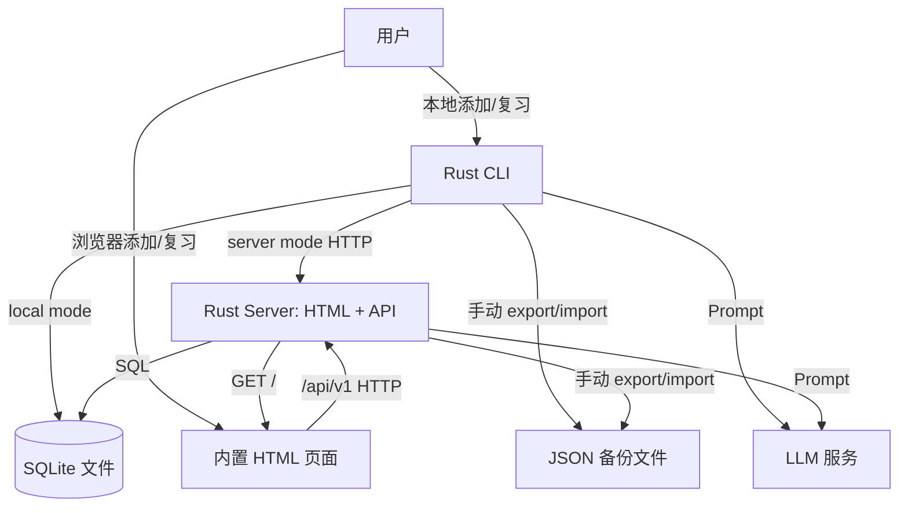

# 架构文档: Neko Words

## 1. 项目结构

- `crates/neko-core`: 领域模型、复习算法、LLM 客户端、服务层、SQLite 仓储。
- `crates/neko-cli`: 命令行工具。
- `crates/neko-server`: Rust/Axum HTTP API，并在同一端口提供内置极简 HTML 页面。
- `web/`: 旧 React/Vite 前端，当前本地默认流程不依赖它。
- `docs/`: 需求和架构文档。

## 2. 系统架构



## 3. 数据库

SQLite 是唯一运行时数据库。默认路径：

```text
~/.neko-words/neko-words.sqlite3
```

### `words`

- `id`: TEXT, UUID 字符串，主键。
- `word`: TEXT。
- `language`: TEXT。
- `translation`: TEXT。
- `examples`: TEXT，JSON 序列化后的例句列表。
- `created_at`: TEXT，RFC3339 时间。
- 唯一约束：`language + word`。

### `reviews`

- `word_id`: TEXT，主键，引用 `words.id`。
- `interval`: INTEGER。
- `ease_factor`: REAL。
- `streak`: INTEGER。
- `next_review_at`: TEXT，RFC3339 时间。
- `last_reviewed_at`: TEXT，可空。
- `history`: TEXT，JSON 序列化后的复习历史。

## 4. 运行模式

- `local`: CLI 直接读写 `[local].db_path`。
- `server`: CLI 和内置 HTML 页面通过 HTTP 访问 Rust server；server 读写 `[server].db_path`。
- 默认建议 `[local].db_path` 和 `[server].db_path` 指向同一个 SQLite 文件。

没有实时同步。跨设备或服务器同步通过手动 JSON 导入导出完成。

## 5. API

- `GET /`: 内置 HTML 页面，支持添加单词和复习。
- `POST /api/v1/words/`: 添加单词。
- `GET /api/v1/reviews/due`: 获取待复习列表。
- `POST /api/v1/reviews/{word_id}/log`: 提交复习记录。
- `POST /api/v1/reviews/{word_id}/undo`: 撤销上次复习。
- `GET /api/v1/export`: 导出 JSON。
- `POST /api/v1/import`: 导入 JSON。

## 6. 部署

`docker-compose.yml` 包含：

1. `server`: Rust server，挂载宿主机 `~/.neko-words` 保存配置和 SQLite，同时提供 API 和内置 HTML 页面。
